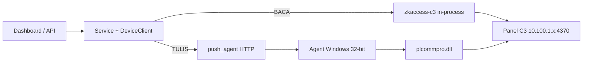
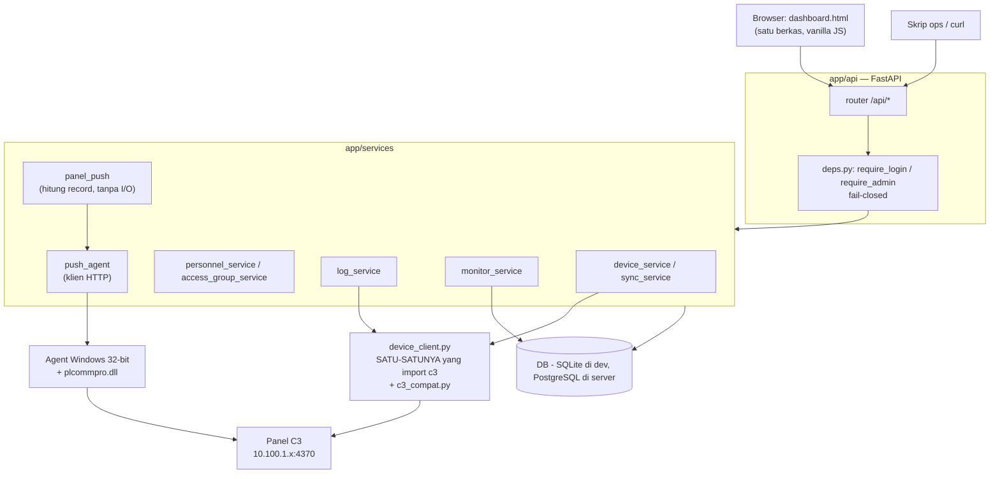
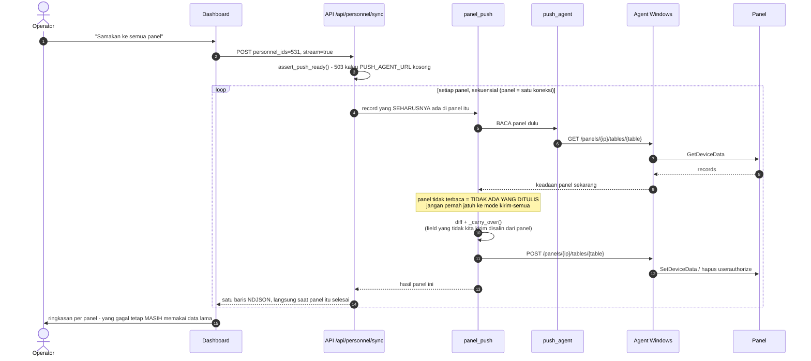
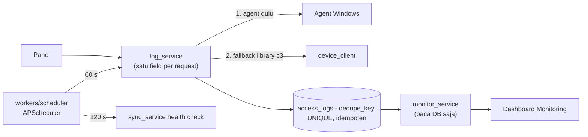

# ZKTeco C3 Access Control

Pengganti ZKAccess 3.5 untuk armada panel **ZKTeco C3** (23 panel, `10.100.1.x`, TCP 4370):
FastAPI + SQLAlchemy 2.0 + Alembic + APScheduler, dashboard satu berkas (vanilla JS, tanpa
build step), dan **Windows push agent** (Python 32-bit) sebagai satu-satunya jalur **menulis**
ke panel.

> **Repo ini PUBLIK** (sejak 2026-09-18). Isinya kode + detail infrastruktur: IP panel
> (`10.100.1.x`), IP server/agent, nama ruangan, dan kredensial bootstrap **default** yang
> didokumentasikan (`AUTH_SEED_USERS`). Yang **tidak** ada di sini: data personel, sandi asli,
> dan token. Semua IP adalah alamat privat yang tidak bisa dijangkau dari internet.
>
> Konsekuensinya: perlakukan inventaris panel sebagai informasi yang sudah diketahui publik, dan
> **jangan pernah** `git add -f` berkas yang sudah diabaikan `.gitignore` (`live_check.db`,
> `*.xls`, `.env`) — begitu masuk satu commit, blob-nya tersimpan permanen di riwayat publik.
> Menjadikan repo ini privat lagi **tidak** menarik kembali salinan yang sudah dikloning orang lain.

## Isi

| Path | Isi |
|---|---|
| `AGENTS.md` | kontrak kerja untuk AI agent — **baca ini dulu** |
| `.github/instructions/` | aturan rinci per area (panel, dashboard, migrasi, tes, deploy, data) |
| `zkteco-backend/app/` | API FastAPI, service, model, dashboard (`static/dashboard.html`) |
| `zkteco-backend/agent/` | push agent Windows + installer Inno Setup |
| `zkteco-backend/migrations/` | revisi Alembic (satu head: `a1d4c7b90e35`) |
| `zkteco-backend/scripts/` | skrip operasional (cek panel, tarik log, salin data, verifikasi) |
| `zkteco-backend/deploy/` | launcher backend lokal + skrip deploy ke server Docker |
| `zkteco-backend/tests/` | pytest (tanpa hardware; device palsu lewat `set_client_factory`) |
| `zkteco-backend/docs/` | INSTALL, TUTORIAL, DEPLOYMENT, catatan protokol firmware |

## Mulai cepat

### Peta alur — baca vs tulis (dua jalur berbeda, jangan tertukar)



**Baca** bisa jalan di mana saja (termasuk server Docker Linux). **Tulis tidak bisa** — panel
hanya bisa ditulis lewat Pull SDK `plcommpro.dll` yang **32-bit**, dan itu artinya selalu ada
**satu PC Windows** yang menjalankan agent. Dua kegagalan yang berbeda artinya:

| Gejala | Artinya |
|---|---|
| push menjawab **503** | `PUSH_AGENT_URL` belum diisi di env proses backend — agentnya belum ditunjuk |
| push gagal koneksi/timeout | URL sudah benar tapi agent-nya mati atau terhalang firewall |

Dua-duanya berakhir sama: **tidak ada yang ditulis ke panel.** `dry_run` tetap jalan tanpa agent.

### 1. Sekali pasang: agent Windows (prasyarat jalur tulis)

| Kebutuhan | Kenapa |
|---|---|
| **Python 32-bit** | DLL 32-bit tidak bisa dimuat Python 64-bit. Ini satu-satunya syarat yang tidak bisa dilewati |
| **Pull SDK resmi** | `plcommpro.dll` **beserta semua `pl*.dll` di sebelahnya** — SDK mencari DLL saudaranya relatif ke *working directory*, itu penyebab error `-201` yang terkenal |
| **VC++ Redistributable x86** | Tanpa ini DLL gagal load dengan pesan menyesatkan "Could not find module" |

Cara tercepat — installer Inno (membuat folder SDK sendiri, jadi `-201` tidak mungkin terjadi):

```powershell
.\zkteco-backend\agent\installer\dist\ZkPushAgent-Setup.exe /TOKEN=<secret> /SDK="C:\PullSDK" /HOST=0.0.0.0 /PORT=8081
```

Manual: install Python 32-bit ke `%LOCALAPPDATA%\Programs\Python\Python313-32`, lalu set env
`ZK_PUSH_AGENT_TOKEN` (**wajib** — agent menolak start tanpa itu), `ZK_PULLSDK_DLL`, dan
`ZK_PUSH_AGENT_HOST=0.0.0.0` kalau backend-nya di mesin lain. Detail lengkap: `zkteco-backend/agent/README.md`.

> Agent di PC itu sudah terpasang dan sudah dipakai produksi. Sebelum mengubah env-nya, ingat
> env dibaca **saat start** — restart agent (`Restart-ScheduledTask ZkPushAgent`) setelah `setx`.

### 2. Cek agent sebelum dipakai (menangkap `-201` lebih dulu)

```powershell
& "$env:LOCALAPPDATA\Programs\Python\Python313-32\python.exe" .\zkteco-backend\agent\check_setup.py --test 10.100.1.12
# exit code: 2 = token belum di-set, 3 = DLL gagal dimuat
```

### 3. Jalankan sehari-hari

```powershell
# backend lokal: proses LATAR + supervisor auto-restart (Ctrl+Shift+B)
.\jalankan-backend.bat
.\status-backend.bat            # status + ekor log
.\hentikan-backend.bat
```

Backend menemukan agent lewat `PUSH_AGENT_URL` + token. Launcher lokal mencari dengan urutan
**parameter → registry (User lalu Machine) → env proses → default**, dan `ZK_PUSH_AGENT_TOKEN`
menang atas `PUSH_AGENT_TOKEN`. Hasilnya selalu dicatat di `logs/supervisor.log` sebagai
`push agent: <url> (<asal>)` dan `agen: OK` / `DITOLAK (401)`.

> **Gejala paling menipu:** semua push menjawab `Authorization: Bearer <token> wajib`. Itu
> **token agent yang tidak cocok**, bukan panel rusak — baca baris `agen:` di `supervisor.log`
> lebih dulu. Token yang benar bisa dibaca dari `CHECK-REPORT.txt` di folder installer agent.

Verifikasi rantai dari mesin backend (jalur ini **sudah terbukti** dari server `192.168.0.27`):

```powershell
curl.exe -H "Authorization: Bearer <token>" http://10.100.1.100:8081/health
# {"ok":true,"dll":"...plcommpro.dll","python_bits":32,"pull_last_error":0}
```

### 4. Push ke panel — gerbangnya wajib dilewati

```powershell
# 1) DRY RUN dulu: tidak menulis apa pun, hanya membandingkan
POST /api/devices/1/personnel/sync?personnel_ids=531&dry_run=true
# 2) lapor hasilnya ke user, minta IZIN
# 3) satu panel uji → verifikasi → baru meluas ke armada
POST /api/personnel/sync?personnel_ids=531          # otoritatif untuk orang bernama
python -m scripts.verify_person_on_panels --badge <pin>
```

`scripts/check_push_write` adalah **satu-satunya skrip yang menulis panel** langsung —
jalankan hanya dengan izin user. Aturan keras: push bersifat diff-based, dan **kalau panel tidak
terbaca maka tidak ada yang ditulis** (jangan pernah jatuh ke mode "kirim semua").

### 5. Tes & lint

```powershell
$PY = "C:\laragon\www\zkteco\zkteco-backend\.venv\Scripts\python.exe"
& $PY -m pytest -q --rootdir "C:\laragon\www\zkteco\zkteco-backend" "C:\laragon\www\zkteco\zkteco-backend\tests"
& $PY -m ruff check "C:\laragon\www\zkteco\zkteco-backend"
& $PY -m ruff format --check "C:\laragon\www\zkteco\zkteco-backend"
```

Tes tidak boleh menyentuh hardware maupun DB nyata (device palsu lewat `set_client_factory`).

### 6. Deploy ke server Docker

```powershell
powershell -ExecutionPolicy Bypass -File .\zkteco-backend\deploy\push_to_server.ps1
```

Perlu diingat: **server itu hanya menggantikan jalur baca + API**. Push dari server tetap menyeberang
ke agent Windows yang sama (`http://10.100.1.100:8081`), jadi PC agent harus hidup dan
`ZK_PUSH_AGENT_HOST=0.0.0.0` + aturan firewall yang mengizinkan IP server itu. Selama backend
laptop masih hidup, `worker` di server sengaja **tidak** dinyalakan (panel hanya menerima satu
koneksi sekaligus).

## Alur program

### Lapisan: siapa boleh memanggil siapa

Aturan arsitektur yang ditegakkan: **route tidak pernah `import c3`** — semua lewat service, dan
hanya `device_client.py` yang menyentuh library panel.



Catatan yang mudah salah:

- **`monitor_service` membaca DB saja, tidak pernah menyentuh panel.** Dashboard Monitoring tidak
  boleh membuat panel sibuk.
- **Scheduler hidup di proses terpisah** (`app/workers/run.py`, `SCHEDULER_ENABLED=true`). Instance
  API memakai `SCHEDULER_ENABLED=false`, kalau tidak setiap worker uvicorn menjalankan ulang job
  yang sama → log ganda.
- Penjaga login terpasang **di router** (`app/api/__init__.py` + `deps.py`), bukan di tiap handler.
  `tests/test_auth.py` menyisir **setiap** route terdaftar dan gagal kalau ada yang bisa dibuka
  tanpa sesi.

### Urutan satu kali push ke panel

Push selalu **baca dulu, tulis kemudian**, dan dihitung per panel (`user`/`userauthorize`/`timezone`
tidak punya kolom device).



Gerbang yang tidak boleh dilewati: `dry_run=true` → lapor → **izin user** → satu panel uji →
verifikasi (`scripts/verify_person_on_panels.py`) → baru meluas. Sapuan armada melaporkan hasil
**per panel** — "selesai" saja tidak cukup, karena panel yang gagal masih memegang data lama.

### Log akses & monitoring



Urutan **agent dulu, library belakangan** itu disengaja: tabel `transaction` tidak bisa dibaca
multi-field di firmware ini, dan pesan errornya berbeda (`-112` = buffer, `-2`/`-107` = sibuk).
Kegagalan baca **bukan** kegagalan tulis — ulangi, jangan simpulkan panel mati.

### Saat start (`lifespan` di `app/main.py`)

1. `Base.metadata.create_all()` — hanya untuk DB baru; Alembic tetap sumber kebenaran skema.
2. Seed time zone `"24 Jam"` (semua panel memakai slot 1).
3. Seed akun dari `AUTH_SEED_USERS` — **hanya kalau tabel `users` kosong**, dan ditandai
   `must_change_password`.
4. `start_scheduler()` — tidak melakukan apa pun kalau `SCHEDULER_ENABLED=false`.

> `dashboard.html` dibaca **saat import**. Setelah mengubahnya, backend harus **di-restart** —
> reload file saja tidak cukup.

## Aturan yang tidak boleh dilanggar

Lihat `AGENTS.md` §3 (aturan emas) — ringkasnya: route API tidak pernah `import c3`; tulis ke
panel hanya lewat agent Windows; sumber kebenaran hak akses adalah `personnel_access_groups`
(+ `access_group_doors`); push bersifat diff-based dan **tidak menulis apa pun kalau panel tidak
terbaca**; baris `user` tidak pernah dihapus (pencabutan = hapus `userauthorize`); dan menulis ke
panel nyata selalu lewat `dry_run` → izin pengguna → satu panel uji → verifikasi.

## Yang sengaja TIDAK ada di repo ini

| Berkas | Alasan |
|---|---|
| `live_check.db` + dua salinannya | memuat 531 personel (nama, nomor kartu, NIK) + log akses |
| `Personnel_*.xls`, `Departmenet.xls` | ekspor data HR |
| `test_zkteco.db` | salinan DB uji |
| `.env` | sandi PostgreSQL + token push agent |
| `logs/`, `*.log` | jejak runtime, bisa memuat token/IP panel |
| `agent/installer/.cache/`, `dist/` | artefak build installer (puluhan MB) |

Semuanya diabaikan `.gitignore` sejak commit pertama, jadi tidak pernah masuk riwayat git.
Menambahkan paksa dengan `git add -f` akan membocorkannya **permanen** — riwayat git tetap
menyimpan blob-nya walau dihapus di commit berikutnya.
