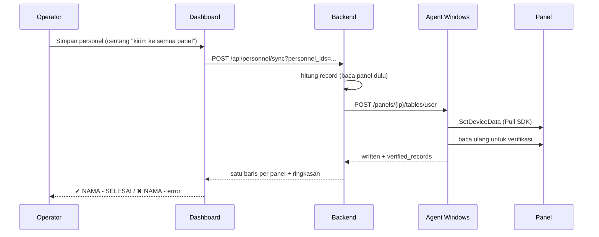

# Tutorial Operasional — ZKTeco C3 Access Control

Panduan ini untuk **operator dan admin**: cara memakai dashboard dari nol sampai
kartu benar-benar bisa membuka pintu, cara mencabut akses, cara memverifikasi, dan
cara mendiagnosis kalau pintu tidak terbuka.

> Cara memasang sistemnya ada di [`INSTALL.md`](INSTALL.md). Aturan yang mengikat
> ada di [`../../AGENTS.md`](../../AGENTS.md).
>
> Semua langkah di sini sudah pernah dijalankan. Perintah bertanda **panel** bisa
> mengubah hardware — jangan dijalankan tanpa izin.

---

## 0. Tiga hal yang harus dipahami lebih dulu

1. **Panel memegang hak versi terakhir yang pernah ditulis, bukan versi dashboard.**
   Mengubah access level di dashboard **tidak** mengubah hardware. Level bisa
   menunjukkan `ICU` sementara pintunya masih membuka untuk level lama yang sudah
   dicabut. Karena itu menyimpan orang di dashboard juga mengirim ke panel (default
   aktif), dan setiap aksi yang tidak mengirim akan bilang **“PANEL BELUM DIUBAH”**.
2. **Satu sumber kebenaran hak akses:** keanggotaan orang↔level
   (`personnel_access_groups`) dan level↔pintu (`access_group_doors`). Level =
   kumpulan pintu (device + nomor pintu), bukan sekadar label.
3. **Nomor yang tercetak di kartu biasanya bukan angka yang dibaca reader.** Nomor
   salah akan ditulis setia ke semua panel tanpa error, dan pintu tidak pernah
   terbuka. Uji di **satu** panel dulu (lihat §5 dan §8).

Alur besar menulis data ke panel:



---

## 1. Membuka dashboard

```
http://localhost:8000/          (dev lokal Windows)
http://<server>:8000/           (produksi)
http://localhost:8000/docs      (Swagger — semua endpoint)
```

**Login dulu.** Dashboard meminta nama pengguna dan password; kalau tidak, halaman
hanya menampilkan kotak login (semua `/api` ditolak server). Dua akun awal:

| Akun | Password awal | Role | Boleh membuka |
|---|---|---|---|
| `admin` | `admin` | Admin | **semua**: Device, kontrol pintu, Cari Device, alamat panel, jam akses, Pengguna |
| `hr` | `hr` | HR | **Access Level**, **Personel** (termasuk kirim ke panel), **Departemen**, **Monitoring** |

Password awal itu **default** dan dashboard terus memperingatkan sampai diganti:
tombol **Ganti password** di kanan atas (perangkat lain yang masih login dengan
akun itu otomatis keluar). Admin juga bisa mengganti password akun lain, atau
menonaktifkan akun, di tab **Pengguna**.

Admin melihat **tujuh** tab: Device, Access Level, Personel, Departemen,
**Cari Device** (scan rentang IP), Monitoring, dan **Pengguna**. Akun HR hanya
melihat empat tab yang jadi pekerjaannya — tab admin **disembunyikan**, dan
server tetap menolak permintaannya walau dikirim tangan (jadi bukan sekadar
tombol yang hilang).

Halaman **terbuka di tab Personel** — itu pekerjaan harian (mencari orang,
membetulkan kartu/level); tab Device dipakai kalau hardware-nya yang berubah.

Kalau dashboard dibuka di browser VS Code, pakai `http://localhost:...`, bukan
`127.0.0.1` (yang kedua ditolak).

---

## 2. Tab **Device** — armada panel

| Kolom | Isi |
|---|---|
| Device Name / Serial Number / IP Address | identitas panel |
| Personnel Count | **jumlah nyata** dari panel (dibaca dari field `UID`), bukan `~MaxUserCount` (kapasitas) |
| Firmware Version | semua panel di sini `AC Ver 5.4.3.2001` |
| Status | online/offline + alasan di baris (`last_error`) |
| (tombol) | **Info** / **Edit** / **Hapus** |

### Mencari & mendaftarkan device

1. **Cari device di jaringan** — UDP broadcast; hanya menjangkau subnet yang sama
   dengan server. Untuk subnet lain (mis. panel `10.100.1.x` dilihat dari server
   `192.168.x`), pakai tab **Cari Device** di bawah.
2. Isi form **Tambah device** (Nama, IP, Port `4370`, Password opsional, Lokasi,
   Area) → **Tambah**. Untuk mengubah, klik **Edit** di baris; form yang sama
   berubah jadi mode edit → **Simpan perubahan** (atau **Batal**).
3. **Get Info (semua device)** me-refresh serial, firmware, jumlah user, dan status
   seluruh armada. **Refresh** hanya memuat ulang daftar.

`ip:port` tidak boleh dobel — kalau bentrok, pesannya muncul di form dan isian
tetap ada supaya bisa diperbaiki.

### Tab **Cari Device** — scan rentang IP

UDP broadcast hanya menemukan panel di subnet yang **sama** dengan server. Kalau
backend berada di jaringan lain (mis. server `192.168.0.27`, panel `10.100.1.x`),
broadcast tidak akan pernah menjawab — pakai tab ini.

1. Tulis satu subnet per baris, mis. `10.100.1.0/24` dan `192.168.1.0/24`.
   Boleh juga IP tunggal (`10.100.1.14`) atau rentang (`10.100.1.10-10.100.1.30`).
2. Biarkan **Baca identitas panel** tercentang untuk membaca serial, nama, dan
   firmware. Langkah ini membuka koneksi nyata ke tiap panel dan dijalankan
   **berurutan** — panel C3 hanya menerima satu koneksi sekaligus, jadi seluruh
   armada bisa butuh puluhan detik. Matikan centangnya kalau hanya ingin tahu
   port mana yang terbuka (jauh lebih cepat).
3. **Mulai scan** → hasil muncul baris demi baris sambil berjalan, dengan
   penghitung `N/M host dipindai`.
4. Panel yang sudah ada di database ditandai **sudah terdaftar** — dicocokkan lewat
   **serial lebih dulu**, baru IP, jadi panel yang alamatnya berubah tetap dikenali
   (kalau hanya lewat IP, panel itu tampak seperti device baru sementara record
   lamanya menunjuk alamat yang tidak dipakai lagi).

Kolom hasil scan:

| Kolom | Arti |
|---|---|
| **IP Address** | alamat yang baru saja menjawab |
| **IP di panel** | alamat menurut **panel itu sendiri** (dibaca dari panel, read-only; arahkan kursor untuk netmask/gateway). `(beda)` muncul kalau berbeda dari kolom kiri. Gateway biasanya kosong — firmware ini tidak melaporkannya |
| **Status** | `sudah terdaftar` · `sudah terdaftar, tapi dashboard menyimpan <alamat lain>` · `belum terdaftar` |
| (tombol) | **Tambah** (device baru) · **Perbaiki IP di dashboard** (record kita masih memakai alamat lama) |

**Tambah** memakai isian **Lokasi**/**Area** di atas tabel. **Perbaiki IP di
dashboard** hanya mengubah catatan di database (dengan konfirmasi yang menyebut alamat
lama dan alamat baru) — panelnya tidak disentuh, dan pengaturan jaringan panel **tidak
pernah** diubah dari sini: alamat yang salah ditulis ke panel membuat panel itu tidak
terjangkau lagi dan hanya bisa diperbaiki fisik di lokasinya. Sisanya dapat tombol **Tambah**.

Yang perlu diingat:

- Scan ini **hanya membaca**: tidak ada data personel, hak akses, atau pengaturan
  jaringan panel yang diubah. Tombol **Tambah** pun hanya menulis database, dan
  pesannya menyebut `PANEL BELUM DIUBAH` — data personel tetap dikirim lewat tab
  Device.
- Hasil kosong belum tentu panelnya mati. Baris petunjuk di atas tabel menunjukkan
  alamat lokal yang dipakai server untuk tiap subnet; kalau tertulis
  `TIDAK ADA RUTE`, server memang tidak punya jalan ke subnet itu.
- Hanya subnet di `SCAN_ALLOWED_NETWORKS` yang boleh dipindai (default
  `10.100.1.0/24,192.168.1.0/24`); rentang di luar itu dijawab `422`. Mengubahnya
  berarti mengubah environment server, bukan mengetik di dashboard.
- Jangan menjalankan scan bersamaan dengan sapuan push — keduanya berebut satu
  koneksi yang sama di panel.
- Lewat terminal: `python -m scripts.scan_range 10.100.1.0/24` (read-only).

### Mengubah alamat panel dari dashboard (opsional, harus dinyalakan dulu)

ZKAccess punya tombol **Modify IP Address**; padanannya adalah kartu **Ubah alamat
jaringan panel** di tab ini. Ini menulis IP/netmask/gateway **ke dalam panel**, bukan ke
database, dan itu satu-satunya operasi di sistem ini yang bisa membuat panel tidak
terjangkau tanpa bisa dikembalikan dari sini.

Karena itu ia **mati secara default**:

1. Nyalakan di server: `PANEL_NETWORK_WRITE_ENABLED=true` di environment backend, lalu
   restart backend. Selama belum dinyalakan, permintaan tulis dijawab **503** dan
   **tidak ada** perintah yang sampai ke panel (dry run tetap boleh). Statusnya juga
   langsung terlihat di kartu begitu device dipilih: "Menulis alamat ke panel:
   NONAKTIF" berarti saklarnya belum dinyalakan di server itu — bukan soal device-nya
   sudah terdaftar atau belum.
2. Uji di **satu** panel lebih dulu, jangan langsung ke semua.
3. Pilih device → **NetMask terisi otomatis** dari panel → isi **IP baru** (wajib di
   dalam `SCAN_ALLOWED_NETWORKS`) dan **gateway manual**: firmware ini tidak melaporkan
   gateway, jadi isi sendiri kalau panel memakainya, atau biarkan kosong kalau memang
   tidak ada.
4. **Cek dulu (dry run)** → periksa peringatannya → tombol **Tulis ke panel** baru aktif
   setelah dry run untuk nilai yang sama persis (ubah satu angka, tombolnya mati lagi).
5. **Tulis ke panel** → konfirmasi yang menyebut alamat lama dan alamat baru.
6. Setelah ditulis, panel **tidak menjawab di alamat lama**; dashboard memverifikasi ke
   alamat **baru**. Kalau panel tidak menjawab, catatan dashboard **tidak** diubah dan
   pesannya menyuruh memeriksa kabel/switch/VLAN atau memperbaiki di lokasi.

Kalau tujuan Anda hanya menyamakan catatan setelah panel dipindah/di-alamatkan manual,
jangan pakai kartu ini — pakai **Perbaiki IP di dashboard** (hanya menulis database).

### Melihat jaringan panel

Tombol **Info** per baris menampilkan konfigurasi jaringan panel sendiri (IP, netmask,
gateway, MAC) di samping alamat yang dipakai dashboard. Kalau berbeda, panel sudah
dipindah tapi database belum — perbaiki lewat **Edit**.

> Mengubah IP **panel** dari sini sengaja tidak disediakan: alamat salah membuat
> panel tidak terjangkau dan tidak bisa dikembalikan dari sini (butuh akses fisik).

### Membuka pintu (remote)

Kartu **Buka pintu (remote)** di bagian bawah tab. Pilih Device → Pintu → Durasi
(default **15 detik**), klik **Buka pintu**, lalu konfirmasi yang menyebut nama
panel, IP, pintu, dan durasi.

- Pintu **benar-benar terbuka** selama durasi itu.
- Kalau konfirmasi dibatalkan, pesannya `Dibatalkan - pintu tidak dibuka.` —
  supaya tidak ada pesan "berhasil" yang tertinggal dari klik sebelumnya.
- Kontrol pintu memakai perintah **CONTROL** (mekanisme berbeda dari SETDATA) dan
  **terbukti bekerja** di hardware nyata.

### Mengirim data personel ke satu panel

Kartu **Kirim data personel ke panel**:

1. pilih Device
2. **Cek dulu (dry run)** → jumlah record dilaporkan (`42 user, 42 authorize`),
   pesannya `Dry run - belum ada yang ditulis.`
3. **Kirim ke panel** → konfirmasi → tulis sungguhan

Push **bersifat diff**: panel dibaca lebih dulu, hanya record baru/berubah yang
ditulis. Kalau panel tidak bisa dibaca, **tidak ada yang ditulis** (bukan jatuh ke
“kirim semua”). Push se-panel bersifat **aditif** — user di panel yang tidak kita
kenal tidak dihapus.

---

## 3. Tab **Access Level** — level = kumpulan pintu

Kolom tabel: Access Level · Pintu · Anggota · Jam Akses.

### Membuat level baru

Kartu **Buat access level**: Nama, Deskripsi (opsional), **Jam Akses** → **Buat**.
Jam Akses otomatis memilih zona **24 Jam**; biarkan begitu kecuali level memang
harus terbatas jam (level dengan jadwal tak sengaja membatasi akan mengunci orang
dari pintu yang hari ini bisa dibuka). Level baru langsung terbuka di kanan.

### Detail level (klik salah satu baris)

- **Pintu**: pilih Device → pilih pintu (`1..lock_count`; armada ini 1–2 pintu per
  panel) → tambah. Pasangan device+pintu yang sudah ada tampil **nonaktif** dengan
  keterangan `(sudah ditambahkan)` supaya tidak dobel.
- **Anggota**: tempel banyak badge sekaligus (satu per baris, atau dipisah koma /
  titik koma) → tambah dalam satu permintaan.
- **Jam Akses**: ganti zona level.
- Setiap baris pintu punya tombol **Hapus** (dengan konfirmasi).

### ⚠️ Tiga aksi yang mengubah level tidak otomatis sampai ke panel

Setelah tiap aksi, dashboard menawarkan pengiriman. **Terima tawarannya**, atau
catat bahwa panel memang belum diubah:

| Aksi | Yang ditawarkan | Cakupan |
|---|---|---|
| Tambah **pintu** | kirim ke panel device itu (`pushPanel`) | satu panel |
| Tambah **anggota** | sapuan terbatas | **hanya device milik level itu** |
| Hapus anggota | sapuan **penuh** | semua panel, karena hak lama bisa tertinggal di mana pun |

Sengaja begitu: menambah anggota dengan menyapu 23 panel akan menenggelamkan panel
yang penting; mencabut anggota harus menyapu penuh supaya tidak ada hak tertinggal.

### Tab **Departemen** — menambah departemen baru

Kartu **Tambah departemen** di atas tabel:

| Field | Catatan |
|---|---|
| **Nama** | wajib, tidak boleh sama dengan yang sudah ada (yang dobel dijawab 409 dan pesannya menyebut namanya) |
| **Induk** | pilih departemen di atasnya; kosong = tingkat atas. Daftarnya terisi otomatis dan pilihan Anda dipertahankan saat refresh |
| **Kode / Deskripsi** | opsional |

Setelah **Tambah**, barisnya langsung muncul di tabel dan bisa langsung dipilih
sebagai **Induk** untuk departemen berikutnya — jadi beberapa departemen sekaligus
bisa dibuat di bawah induk yang sama tanpa mengisi ulang. Departemen baru langsung
muncul di pilihan **Departemen** pada form personel.

---

## 4. Tab **Personel** — orang dan haknya

Tabel: badge/PIN, nama, kartu, departemen, dan pil access level. Ada kotak
pencarian (fokus di kotak ini menyeleksi isi lama supaya pencarian berikutnya tidak
menempel jadi `"tes" + "budi"`).

### Menambah / mengedit orang

Satu form dipakai untuk keduanya (`Tambah` ↔ `Simpan perubahan`):

| Field | Catatan |
|---|---|
| **Badge / PIN** | yang dipakai panel (`Pin`); boleh diubah saat edit |
| **Nama** | muncul di panel |
| **No. Kartu** | **unik**, boleh dikosongkan (mengosongkan = melepas kartu) |
| **Departemen** | pilih dari master, atau ketik nama baru di form (dibuat otomatis) |
| **Access level** | centang, boleh lebih dari satu; ada penghitung live dan tombol **Kosongkan** |
| **Setelah simpan, kirim ke semua panel** | **default aktif** — lihat di bawah |

Badge dan nomor kartu tidak boleh sama dengan orang lain; kalau bentrok, pesannya
menyebut field, nilainya, dan pemiliknya (mis. *“No. kartu 5001 sudah dipakai Budi”*).
Dashboard juga memeriksa duluan dari cache supaya kesalahan terlihat instan.

### Centang “kirim ke semua panel”

Kalau dicentang: simpan di-commit, lalu orang itu dikirim ke **setiap** panel yang
seharusnya memuatnya, dan hak yang sudah tidak dia pegang **dicabut** di semua panel.
Hanya orang ini yang dikirim — ratusan user lain di tiap panel tidak disentuh.

Prosesnya tampil sebagai popup progres yang tidak bisa ditutup sampai selesai, satu
baris per panel:

```
✔ RUANGAN SERVER - SELESAI, 3 hak ditulis
✖ ICU - error: ...
- RM LT3 - tidak memuat orang ini
```

Ringkasan akhirnya jelas: `SELESAI - ...` atau `N panel GAGAL ... MASIH memakai
data lama` (warna error). **Bukan** "selesai" saja. Kalau API menjawab 503:
`Panel BELUM diubah.`

Kalau centang **dimatikan**: perubahan hanya masuk database, dan pesannya
`PANEL BELUM DIUBAH` — memang disengaja untuk kasus nomor kartu yang belum
terbukti (lihat §5).

Tombol **Samakan ke semua panel** mengulang sapuan yang sama kapan saja.

---

## 4b. Tab **Monitoring** — feed akses live & kesehatan panel

Tab ini menjawab dua pertanyaan sekaligus: **panel mana yang sedang mati**, dan
**siapa yang baru lewat pintu**.

**Status panel** — satu baris per panel: online/offline, kapan terakhir terlihat,
kapan log terakhir ditarik, berapa user yang terbaca di panel, dan error terakhir.
Angka online/offline datang dari pemeriksaan berkala scheduler (`health_check`),
bukan dari koneksi halaman ini.

**Feed akses** — baris terbaru di atas:

| Kolom | Artinya |
|---|---|
| **Hasil** | `diterima` = panel menerima kartu (`EventType 0`, `NORMAL_PUNCH_OPEN`). `ditolak` = kartu tidak dikenal (`EventType 27`, `UNREGISTERED_CARD`). Kode lain tampil apa adanya **tanpa warna** (mis. `DEVICE_START`, `WG_FORMAT_ERROR`) karena artinya belum terverifikasi &mdash; menebak "diterima" pada sebuah penolakan lebih berbahaya daripada tidak ada warna. |
| **Kartu** | Nomor yang tersimpan. Pada baris **ditolak**, itu nomor yang **benar-benar dibaca reader** &mdash; alat diagnosis utama kalau kartu baru tidak membuka pintu (§8). |
| **Orang** | Nama dari database (dicocokkan lewat PIN), jadi orang yang belum pernah di-push tetap muncul walau tanpa nama. |

Filter di atas feed menyaring nama / PIN / nomor kartu / nama panel. Centang
**Hanya akses ditolak** untuk menyisakan penolakan saja &mdash; cara tercepat
menjawab "ada yang mencoba masuk tapi ditolak?".

**Tanggal** berlaku untuk keduanya sekaligus: feed hanya menampilkan aktivitas hari
itu, dan **Tarik log sekarang** hanya **menyimpan** baris hari itu. Default-nya
**hari ini**; tombol **Semua tanggal** mengosongkan batas itu kalau Anda ingin
menelusuri riwayat. Perlu dipahami: panel selalu mengirim **seluruh** isi buffer
transaksinya sekali baca, jadi tanggal **tidak** membuat pembacaannya lebih kecil
&mdash; yang dibatasi adalah apa yang masuk database. Baris di luar tanggal tetap
terbaca lalu dibuang, dan jumlahnya dilaporkan ("N baris di luar tanggal dibuang")
supaya hasil kosong tidak disangka kegagalan baca.

Tombol **Mulai pantau** membuka satu sambungan (`GET /api/monitor/stream`), dan
**meninggalkan tab ini otomatis menghentikannya** &mdash; tidak pernah ada dua feed
berjalan sekaligus. Interval periksa bisa dipilih 2&ndash;30 detik; mengubahnya
membuka ulang feed dengan interval baru.

### ⚠️ Kalau feed-nya diam, itu belum berarti tidak ada aktivitas

Feed ini membaca **database**, bukan panel. Panel C3 hanya menerima **satu koneksi
sekaligus**, jadi memantau langsung ke panel akan berebut koneksi dengan scheduler
dan push &mdash; dan panel yang sehat bisa tampak offline. Akibatnya: feed hanya
bergerak secepat penarik log.

Kalau halaman menampilkan **peringatan merah `SCHEDULER_ENABLED=false`**, berarti
sedang tidak ada yang menarik log dari panel (`jalankan-backend.bat` dan unit
systemd `zkteco-api` memang memakai setelan itu, supaya tidak ada dua penarik yang
berebut koneksi). Pilihannya:

- tekan **Tarik log sekarang** (`POST /api/logs/pull`) &mdash; semua panel dibaca
  **satu per satu**, **hanya membaca**, tidak mengubah apa pun. Kalau ada push sedang
  berjalan, sebagian panel bisa gagal; lebih baik tunggu sapuan push selesai. Panel
  yang log-nya sangat besar (puluhan ribu transaksi) hanya bisa dibaca lewat agent
  dengan buffer besar: kalau pesannya menyebut `ZK_AGENT_BUFFER_SIZE`, naikkan
  setelan itu (mis. `4194304`) lalu **restart agent** &mdash; itu batas buffer, bukan
  panel rusak; atau
- jalankan scheduler pada proses server (`SCHEDULER_ENABLED=true`) &mdash; proses
  worker/supervisor yang sudah ada memang untuk itu.

Tanpa salah satu langkah di atas, tab ini tetap benar: ia hanya menampilkan log yang
sudah tersimpan, dan **tidak ada yang rusak** pada panel atau pintunya.

---

## 5. Resep: karyawan baru sampai kartunya bisa membuka pintu

1. **Pastikan pintunya ada di level yang tepat.**
   Tab **Access Level** → pilih level (mis. `AKSES UMUM KARYAWAN`) → kalau pintu
   yang dituju belum ada, tambahkan (Device + Pintu) dan **terima tawaran kirim**
   ke panel device itu.
2. **Tambahkan orangnya.** Tab **Personel** → isi Badge/PIN, Nama, Departemen,
   centang level-nya.
3. **Untuk kartu yang belum terbukti di reader**, lepaskan centang
   *Setelah simpan, kirim ke semua panel* dulu → **Tambah**. Panel belum berubah.
4. **Kirim ke SATU panel saja.** Tab **Device** → pilih panel tempat kartu akan
   diuji → **Cek dulu (dry run)** → **Kirim ke panel**.
5. **Uji kartunya di pintu panel itu.** Kalau terbuka, lanjut. Kalau tidak, ikuti
   §8 (nomor yang tercetak biasanya bukan angka yang dibaca reader).
6. **Simpan ulang dengan centang aktif** (atau klik **Samakan ke semua panel**)
   supaya orang ini masuk ke semua panel yang seharusnya memuatnya.
7. **Buktikan.** Jalankan pemeriksaan di semua panel:

   ```powershell
   Push-Location "C:\laragon\www\zkteco\zkteco-backend"
   $env:DATABASE_URL="sqlite:///C:/laragon/www/zkteco/zkteco-backend/live_check.db"
   & ".\.venv\Scripts\python.exe" -m scripts.verify_person_on_panels --badge 202404025
   Pop-Location
   ```

   Hasilnya memisahkan **cocok / hak tertinggal / hak belum ada / tidak terbaca**
   untuk setiap panel yang seharusnya memuatnya.

---

## 6. Resep: mencabut atau memindahkan akses

1. Tab **Personel** → cari orangnya → klik **Edit**.
2. Ubah centang level (untuk memindahkan: lepas level lama, centang yang baru).
3. Pastikan **Setelah simpan, kirim ke semua panel** aktif → **Simpan perubahan**.

Sapuan untuk orang tertentu bersifat **otoritatif**: hak yang seharusnya tidak lagi
dimiliki **dihapus** dari `userauthorize` (baris `user`-nya tetap ada — user tidak
pernah dihapus, supaya field yang tidak kita kirim tidak hilang). Ringkasannya
menyebut `hak ditulis` dan `hak dicabut`.

> Mengapa orang tertentu berbeda dari push se-panel: panel menyimpan user yang tidak
> kita ketahui (contoh nyata: `OK PETUGAS` memegang **405** user sementara level kita
> hanya menjelaskan **361**). Mencabut yang tidak dikenal akan mengunci orang lain
> keluar, jadi hanya sapuan bernama yang mencabut.

---

## 7. Resep: menyamakan seluruh armada

- **Kirim data personel ke panel** (tab Device) untuk satu panel.
- **Samakan ke semua panel** (tab Personel) untuk satu orang di semua panel.
- Untuk skrip/sapuan tanpa UI:

  ```bash
  # satu orang, semua panel, tanpa menulis
  curl -X POST "http://localhost:8000/api/personnel/sync?personnel_ids=531&dry_run=true"

  # dengan progres per panel (NDJSON, satu baris per panel + baris ringkasan)
  curl -N -X POST "http://localhost:8000/api/personnel/sync?personnel_ids=531&stream=true"

  # seluruh panel, satu device
  curl -X POST "http://localhost:8000/api/devices/12/personnel/sync?dry_run=true"
  ```

`personnel_ids` membatasi sapuan ke orang-orang itu; `device_ids` (opsional)
membatasi panelnya.

---

## 8. Kalau pintu tidak terbuka dengan kartu baru

Ini kegagalan nomor satu di lapangan, dan **tidak ada error di mana pun**. Urutan
pemeriksaannya:

1. **Apakah orangnya sudah dikirim ke panel itu?** Record di dashboard baru sampai
   ke panel setelah push. Orang uji yang tidak pernah di-push gagal persis seperti
   nomor kartu yang salah. Cek dengan
   `python -m scripts.verify_person_on_panels --badge <pin>`.
2. **Apakah panel benar-benar membaca nomornya?** Baca tabel `transaction` panel:

   ```bash
   curl -H "Authorization: Bearer <token>" \
        "http://127.0.0.1:8081/panels/10.100.1.12/tables/transaction?fields=Pin,Cardno,EventType"
   ```

   | Yang terlihat | Artinya |
   |---|---|
   | baris `Cardno` = nomor kita, `Pin=0`, `EventType=27` | nomor benar, **hak aksesnya** yang belum/tidak given |
   | `Cardno` = nomor **lain** dari yang kita tulis | reader membaca angka berbeda (Wiegand ≠ angka tercetak) → tulis angka itu |
   | `EventType=0` | kartu diterima dan pintu dibuka |
   | **tidak ada baris sama sekali** | panel tidak pernah membaca angka itu |

   Contoh nyata: tertulis `4063788292` → 0 kemunculan di 23 panel; reader melihat
   `2150141426` → 11 penolakan. Setelah angka yang benar ditulis dan di-push,
   muncul `EventType 0`.
3. **Simpan angka tercetak di kolom Nama** (mis. `Budi (4063788292)`) — itu satu-satunya
   label yang dibawa kartu saat menelusuri masalah.
4. **Catatan pembacaan gagal:** kode `-112` pada panel dengan log besar hanya berarti
   balasan melebihi buffer 64 KB, bukan panel mati. Kode `-2`, `-107` juga transien —
   ulangi.

---

## 9. Jebakan harian yang perlu diingat

- **Panel hanya menerima satu koneksi sekaligus.** Gagal satu kali bukan berarti
  panel mati; kalau dashboard menampilkan 20/23 online, cek ulang satu per satu.
  Karena itu scheduler dimatikan di proses API (`SCHEDULER_ENABLED=false`).
- **Jangan mengklik ulang saat popup progres berjalan.** Sapuan 23 panel butuh
  beberapa detik; sebagian panel bisa gagal sendiri-sendiri dan panel yang gagal
  **masih memegang data lama**.
- **`SetDeviceData` mengganti record, bukan menambal.** Field yang tidak dikirim
  akan dikosongkan; backend menyalin nilai panel sendiri untuk `Password, Group,
  StartTime, EndTime, SuperAuthorize, Disable`, jadi penulisan ulang tidak menghapus
  data. Jangan matikan mekanisme ini.
- **Konfirmasi selalu lewat dialog aplikasi**, bukan dialog bawaan browser. Kalau
  sebuah tombol langsung bilang "Dibatalkan", itu dialog native yang diblokir
  browser/webview — bukan fitur rusak.
- **`OK PETUGAS` istimewa.** Panel itu memegang 405 user sedangkan level kita hanya
  menjelaskan 361, dan serial/LockCount-nya tidak bisa dibaca software ini.
  Selidiki sebelum push ke sana.
- **Field yang belum dikirim:** tanggal berlaku (`StartTime`/`EndTime`, format
  `YYYYMMDD` — hasil inferensi, belum diverifikasi) dan baris `timezone`. Level tetap
  menyimpan `device_timezone_id`, tetapi definisi zona waktunya belum ditulis ke panel.
- **Jangan hapus `live_check.db`.** Itu database dev nyata (23 device / 531 personel),
  bukan file percobaan. (`test_zkteco.db` di root & di dalam `zkteco-backend/` adalah
  sisa percobaan dan boleh diabaikan.)

---

## 10. Endpoint yang sering dipakai

| Kebutuhan | Endpoint |
|---|---|
| **Login / keluar / siapa saya / ganti password** | `POST /api/auth/login` · `POST /api/auth/logout` · `GET /api/auth/me` · `POST /api/auth/password` |
| **Akun pengguna (admin)** | `GET/POST /api/users` · `PATCH/DELETE /api/users/{id}` |
| Ringkasan armada | `GET /api/dashboard/devices` · `GET /api/dashboard/summary` |
| Perangkat | `GET/POST /api/devices` · `PATCH/DELETE /api/devices/{id}` |
| Info / health panel | `POST /api/devices/{id}/info` · `POST /api/devices/{id}/health` |
| Cari panel (UDP) | `GET /api/devices/discover` |
| Cari panel pada rentang IP | `POST /api/scan` (+`&stream=true`) · `GET /api/scan/local-networks` |
| Baca/ubah alamat jaringan panel | `GET /api/devices/{id}/network` · `POST /api/devices/{id}/network?dry_run=true` |
| Buka pintu | `POST /api/control/devices/{id}/open` |
| Jumlah user di panel | `GET /api/devices/{id}/personnel/count` |
| Baca user dari panel | `GET /api/devices/{id}/personnel` |
| Impor user dari panel | `POST /api/devices/{id}/personnel/import` |
| **Kirim satu panel** | `POST /api/devices/{id}/personnel/sync?dry_run=true` |
| **Kirim satu orang** | `POST /api/personnel/sync?personnel_ids=1,2[&dry_run=true][&stream=true]` |
| Personel | `GET/POST /api/personnel` · `GET/PATCH/DELETE /api/personnel/{id}` |
| Level akses | `GET/POST /api/access-groups` + `/{id}/doors` + `/{id}/members` |
| Jam akses | `GET/POST /api/time-zones` · `POST /api/time-zones/presets/24-hours` |
| Departemen | `GET/POST /api/departments` · `GET /api/departments/tree` |
| Log akses | `POST /api/logs/devices/{id}/pull` · `GET /api/logs/devices/{id}/realtime` |
| Monitoring — sekali lihat | `GET /api/monitor/snapshot` |
| Monitoring — feed live | `GET /api/monitor/stream?interval=5` (NDJSON) |

**Perhatikan kode balasan push:** `404` device tidak ada · **`503` agent belum
dikonfigurasi** (`PUSH_AGENT_URL` kosong) · **`502`** agent/panel gagal.
`POST /api/control/devices/{id}/open` bisa menjawab **HTTP 200 dengan
`{"success": false}`** — yang diperiksa adalah `success`, bukan status HTTP.

---

## 11. Perintah verifikasi (semuanya read-only kecuali ditandai)

```powershell
Push-Location "C:\laragon\www\zkteco\zkteco-backend"
$env:DATABASE_URL="sqlite:///C:/laragon/www/zkteco/zkteco-backend/live_check.db"
$py = "C:\laragon\www\zkteco\zkteco-backend\.venv\Scripts\python.exe"

& $py -m scripts.check_panels --csv ..\devices_input.csv        # rute ke 23 panel
& $py -m scripts.live_check --limit 5                            # baca panel nyata
& $py -m scripts.boot_check                                      # endpoint lewat HTTP
& $py -m scripts.inspect_panel_tables --ip 10.100.1.12           # dump tabel panel (read-only)
& $py -m scripts.verify_person_on_panels --badge 202404025       # satu orang di semua panel
& $py -m scripts.check_push_write 10.100.1.12                    # ⚠️ MENULIS (butuh izin)

Pop-Location
```

Urutan aman untuk setiap perubahan yang menyentuh hardware:
**`dry_run` → laporkan → minta izin → satu panel uji → verifikasi → baru meluas.**

---

## 12. Rutinitas yang disarankan

| Kapan | Yang dilakukan |
|---|---|
| Setiap hari | Cek tab **Device**: jumlah online, `last_error` yang mencurigakan, jumlah personel per panel |
| Setiap perubahan data | Pastikan panel sudah dikirim (centang aktif / terima tawaran kirim) |
| Setelah menerima kartu baru | Uji di **satu** panel sebelum menyapu semua panel |
| Kalau ada laporan pintu tidak terbuka | §8, mulai dari `verify_person_on_panels` lalu tabel `transaction` |
| Sebelum perubahan besar | `dry_run=true` dulu, catat angkanya, dan siapkan ZKAccess sebagai pembanding |
| Berkala (mingguan) | Bandingkan dengan ZKAccess read-only kalau ada selisih yang tidak dijelaskan |
